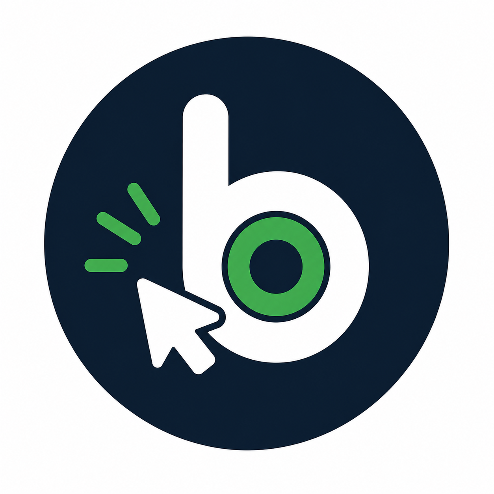

<div align="center">



# byob

**Bring Your Own Browser** — let your AI agent drive the Chrome you're already logged into.

[](LICENSE)
[](tsconfig.base.json)
[](https://modelcontextprotocol.io)
[](https://developer.chrome.com/docs/extensions/mv3/intro/)
[](CHANGELOG.md)

**English** · [中文](README.zh-CN.md)

</div>

---

## What is this

**byob** is a local-only [MCP](https://modelcontextprotocol.io) server that lets Claude Code, Cursor, Cline (or any MCP client) drive **your real Chrome** — with your cookies, your sessions, your reCAPTCHA solves. Ten browser tools: read pages, click, type, screenshot, navigate, wait, list/switch tabs, dump cookies, and (opt-in) run JavaScript.

```
┌──────────────────┐  MCP    ┌──────────┐  UNIX   ┌──────────┐  Native    ┌──────────┐  CDP    ┌─────────────┐
│ Claude Code /    │ ──────▶ │ byob-mcp │ ──────▶ │  byob-   │  Messaging │ byob ext │ ──────▶ │ Chrome tab  │
│ Cursor / Cline / │  stdio  │  (Node)  │  socket │  bridge  │ ─────────▶ │  (MV3)   │         │ (your real  │
│ any MCP client   │         │          │         │  (Node)  │            │          │         │  session)   │
└──────────────────┘         └──────────┘         └──────────┘            └──────────┘         └─────────────┘
```

**No cloud.** No API key. No telemetry. Three Node processes that all live and die on your laptop, plus one Chrome extension running on your machine. When Chrome is closed everything is `0` resident memory.

---

## Why not just use WebFetch / Puppeteer?

| | `WebFetch` | Headless Puppeteer | **byob** |
|---|:-:|:-:|:-:|
| Reads JS-rendered pages | ❌ | ✅ | ✅ |
| Sees content behind login | ❌ | ⚠️ (cookie copy-paste) | ✅ (your real session) |
| Bypasses anti-bot for your sites | ❌ | ❌ (`navigator.webdriver`, captchas) | ✅ (it's a real browser doing real input) |
| Doesn't burn money on a headless cloud | ✅ | ❌ | ✅ |
| Setup time | 0 | hours | **5 min** |

byob's pitch: **the cheapest, most stealth, most session-rich browser-as-a-tool an LLM agent can have, because it *is* the browser you're already using.**

---

## Quickstart (5 minutes)

> Requires: macOS or Linux, Chrome 116+, [bun](https://bun.com/), Node 20+, `openssl` in `PATH`.

```sh
# 1 — clone + install
git clone https://github.com/<you>/byob ~/code/byob
cd ~/code/byob
bun install

# 2 — one-shot setup: generate per-user key, build the extension,
#     write Native Messaging manifests for every browser detected
( cd packages/bridge && bun run dev:cli install --dev )
# Follow the on-screen instructions; you'll be told the exact
# extension folder to load and the exact `claude mcp add` line to run.

# 3 — load the extension in Chrome
# chrome://extensions  →  Developer mode  →  "Load unpacked"
# → select packages/extension/.output/chrome-mv3
# Quit Chrome (⌘Q) and reopen — Chrome only re-reads the NM manifest on launch.

# 4 — verify
( cd packages/bridge && bun run dev:cli doctor )
# Expect four green ✓.

# 5 — connect Claude Code
# (the install step printed this exact line; just paste & run)
claude mcp add byob -s user -- /Users/$USER/code/byob/packages/mcp-server/node_modules/.bin/tsx /Users/$USER/code/byob/packages/mcp-server/bin/byob-mcp.ts
# Optional: prepend `-e BYOB_ALLOW_EVAL=1` to enable browser_eval.
```

Open a new Claude Code session and say:

> *use byob to read https://news.ycombinator.com — give me the top 5 stories*

byob opens a background tab in your Chrome, scrolls it, hands the structured page back to Claude, and closes the tab. No clouds were billed in the making of this answer.

---

## Tools

| Tool | What it does | Token-cheap? |
|---|---|---|
| `browser_read` | Auto-scrolls a page (SPA-aware), returns text + chunks with screen positions | ✅ chunks |
| `browser_screenshot` | Full-page or viewport PNG/JPEG, **returns file path** (not base64) | ✅ path-only |
| `browser_click` | Real mouse events via CDP (not synthetic DOM events — beats most anti-bot) | ✅ |
| `browser_type` | Focus + `Input.insertText`; optional `clear` and `pressEnter` | ✅ |
| `browser_get_cookies` | Dumps cookies for a domain — replay sessions in `curl` without re-opening Chrome | ✅ |
| `browser_navigate` | Open or reuse a tab to a URL; supports `load` / `domcontentloaded` / `networkidle` | ✅ |
| `browser_wait_for` | MutationObserver-based wait for `visible` / `hidden` / `attached` / `detached` | ✅ |
| `browser_list_tabs` | Returns id, url, title, active flag, windowId for every open tab | ✅ |
| `browser_switch_tab` | Activate a tab + bring its window to the foreground | ✅ |
| `browser_eval` | Run arbitrary JS in a tab — **opt-in** via `BYOB_ALLOW_EVAL=1` env on the MCP server | ⚠️ |

Full input/output schemas: [`shared/src/schemas.ts`](shared/src/schemas.ts).

---

## Security

This section deserves a slow read. byob borrows enormous power from your Chrome — handle the controls accordingly.

| Concern | Mitigation |
|---|---|
| **Yellow "byob is debugging this tab" banner** | Chrome shows this **always** when CDP is attached. It cannot be suppressed by an extension. This is a feature, not a bug — every legit CDP user lives with it. |
| **`browser_eval` is dangerous** | Hidden from the LLM unless `BYOB_ALLOW_EVAL=1`. Throttled to 5 calls/min/tab. Every call writes to `~/.byob/eval-audit.log` and surfaces a Chrome notification. |
| **URL blacklist** | Reads/navigates to `chrome:` `chrome-extension:` `about:` `devtools:` `view-source:` `file:` are denied. Auth domains (`accounts.google.com` etc.) too. |
| **Bridge socket** | UNIX domain socket at `~/.byob/bridges/<deviceId>.sock`, mode `0600`, parent `0700`. `umask(0o077)` enforced. |
| **Per-user extension key** | First `byob install` generates `~/.byob/extension-key.pem` (mode `0600`). Two byob installs on two machines have two different extension IDs — no global collision. |
| **No telemetry** | byob makes zero outbound network calls of its own. Nothing leaves your machine. |

---

## Management CLI

Once the bridge is installed, the `byob` command (alias for `bun --cwd packages/bridge run dev:cli`) gives you:

```sh
byob install [--dev] [--skip-build]   # one-shot setup, runs key gen → ext build → manifests
byob doctor                            # diagnose every link in the chain (manifest, launcher, bridge, socket)
byob bridges                           # list live bridge processes (one per Chrome profile)
byob logs [-f]                         # tail ~/.byob/bridge.log
byob uninstall                         # remove launcher + Native Messaging manifests
```

Try `byob doctor` whenever something feels off — it usually points at the broken link in three lines of output.

---

## Troubleshooting

| Symptom | Likely cause + fix |
|---|---|
| `No live bridge` | Chrome is closed or the byob extension is disabled. Open Chrome and confirm at `chrome://extensions`. |
| `cdp_attach_failed` | DevTools (F12) is open on the target tab, or another extension is holding `chrome.debugger`. Close them and retry — byob also retries 3× internally. |
| `url_forbidden` on a real URL | URL is on the default blacklist (chrome://, file://, auth domains). See Security; can be opted out via env. |
| `extension_not_connected` | Reload the extension in `chrome://extensions`; bridge will reattach on its own (1s backoff, capped 30s). |
| Yellow "byob is debugging this tab" banner won't go away | This is by design and cannot be removed by the extension. Live with it or detach the session. |
| Brand-new install isn't picked up by Chrome | Chrome caches Native Messaging manifests on launch — fully quit Chrome (⌘Q) and reopen, not just close the window. |

---

## Architecture & design notes

For the deeply curious:
- [Design spec](docs/superpowers/specs/2026-04-25-byob-design.md) — goals, non-goals, every protocol, every data flow, every rejected alternative.
- [Implementation plan](docs/superpowers/plans/2026-04-25-byob-implementation.md) — the 7-phase build log.
- [E2E checklist](docs/e2e-checklist.md) — manual smoke tests run before each release.
- [`shared/src/schemas.ts`](shared/src/schemas.ts) — single source of truth for all 10 tool schemas.

The TL;DR design choices:

- **MCP-first**, no SaaS. byob is just a tool a local agent can call.
- **WXT** for the extension (2026 MV3 standard; Plasmo and CRXJS have stalled).
- **Node** for the bridge (Bun has known crashes in Native Messaging stdio handling).
- **Bun** for everything else (workspaces, dev runner via tsx).
- **Single source of truth** — Zod schemas in `@byob/shared` consumed by extension, bridge, and mcp-server. No protocol drift across processes.

---

## Roadmap

See [`CHANGELOG.md`](CHANGELOG.md) for the full v0.1 feature log and the deferred-to-v0.2 list. Highlights of what's coming:

- **`browser_download_images`** — separate tool that scroll-triggers lazy loaders and dumps every `` to disk via loopback HTTP.
- **Cancel propagation** — Ctrl+C in your MCP client cleanly detaches CDP.
- **CDP fallback to `chrome.scripting`** — graceful degradation when DevTools blocks attach.
- **Cross-frame iframe support** — `Page.getFrameTree` + executionContextId switching.
- **Wake/sleep detection** — bridge ticks 1s, on a 5s+ gap signals the extension to reset CDP state (helps after `lid close → wake`).

PRs welcome on any of these — see [CONTRIBUTING.md](CONTRIBUTING.md).

---

## License

MIT. See [LICENSE](LICENSE).

byob borrows enormous power from your Chrome. Use it on machines and accounts you control.
