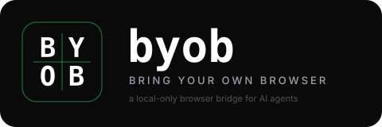

<div align="center">



**让你的 AI agent 直接驱动你已经登录的真实 Chrome。**

[](LICENSE)
[](tsconfig.base.json)
[](https://modelcontextprotocol.io)
[](https://developer.chrome.com/docs/extensions/mv3/intro/)
[](CHANGELOG.md)

[English](README.md) · **中文**

</div>

---

## 这是什么

**byob** 是一个**纯本地** [MCP](https://modelcontextprotocol.io) server，让 Claude Code、Cursor、Cline（或任何 MCP 客户端）能驱动**你正在用的真实 Chrome** —— 用你的 cookie、你的登录态、你已经过的 reCAPTCHA。10 个浏览器工具：抓页面、点击、填表、截图、跳转、等元素、列/切 tab、导出 cookie，还有（需要主动开启的）执行 JS。

```
┌──────────────────┐  MCP    ┌──────────┐  UNIX   ┌──────────┐  Native    ┌──────────┐  CDP    ┌─────────────┐
│ Claude Code /    │ ──────▶ │ byob-mcp │ ──────▶ │  byob-   │  Messaging │ byob ext │ ──────▶ │  Chrome tab │
│ Cursor / Cline / │  stdio  │  (Node)  │  socket │  bridge  │ ─────────▶ │  (MV3)   │         │ (你真实的    │
│ 任何 MCP 客户端  │         │          │         │  (Node)  │            │          │         │  浏览器会话) │
└──────────────────┘         └──────────┘         └──────────┘            └──────────┘         └─────────────┘
```

**没有云**。没有 API key、没有 telemetry。三个 Node 进程全在你笔记本上跑生死，加上一个装在你 Chrome 里的扩展。Chrome 不开的时候，byob 占用 = `0`。

---

## 跟 WebFetch / Puppeteer 比有啥区别

| | `WebFetch` | 无头 Puppeteer | **byob** |
|---|:-:|:-:|:-:|
| 能读 JS 渲染的页面 | ❌ | ✅ | ✅ |
| 能看到登录后的内容 | ❌ | ⚠️ (要手动复制 cookie) | ✅ (直接复用你登录态) |
| 能绕过你常用网站的反爬 | ❌ | ❌ (`navigator.webdriver`、被 captcha 卡住) | ✅ (本来就是真浏览器在做真输入) |
| 不烧云端无头浏览器的钱 | ✅ | ❌ | ✅ |
| 配置时间 | 0 | 几小时 | **5 分钟** |

byob 的卖点：**对 AI agent 来说最便宜、最不容易被识破、登录态最丰富的"浏览器即工具" —— 因为它本来就是你正在用的浏览器。**

---

## 5 分钟快速开始

> 前置：macOS 或 Linux、Chrome 116+、[bun](https://bun.com/)、Node 20+、`PATH` 里有 `openssl`。

```sh
# 1 — clone + 装依赖
git clone https://github.com/<你>/byob ~/code/byob
cd ~/code/byob
bun install

# 2 — 一条命令搞定：自动生成你本地的 RSA key、build 扩展、写好 NM manifest
( cd packages/bridge && bun run dev:cli install --dev )
# 跟着屏幕提示走，会精确告诉你扩展目录在哪、claude mcp add 命令长啥样

# 3 — Chrome 里加载扩展
# chrome://extensions  →  开"开发者模式"  →  "加载已解压的扩展程序"
# 选: packages/extension/.output/chrome-mv3
# 然后完全退出 Chrome (⌘Q) 再打开 —— Chrome 只在启动时读 NM manifest

# 4 — 确认链路通
( cd packages/bridge && bun run dev:cli doctor )
# 期望 4 个绿色 ✓

# 5 — 注册到 Claude Code (上一步已经把这条命令打印在屏幕上了，复制即可)
claude mcp add byob -s user -- /Users/$USER/code/byob/packages/mcp-server/node_modules/.bin/tsx /Users/$USER/code/byob/packages/mcp-server/bin/byob-mcp.ts
# 想启用 browser_eval 就在 -s user 后加 -e BYOB_ALLOW_EVAL=1
```

开新的 Claude Code 会话，问它：

> *用 byob 帮我读 https://news.ycombinator.com，给我前 5 条新闻标题*

byob 会在你 Chrome 里开个后台 tab、滚屏抓内容、把结构化结果递给 Claude，然后关 tab。整个过程没花一分云端钱。

---

## 工具列表

| 工具 | 功能 | 省 token？ |
|---|---|---|
| `browser_read` | 自动滚屏读页（SPA 友好），返回正文 + 带屏幕坐标的结构化 chunks | ✅ chunks |
| `browser_screenshot` | 整页或视口截图，PNG/JPEG，**返回文件路径**（不是 base64） | ✅ 只返路径 |
| `browser_click` | 通过 CDP 发真实鼠标事件（不是 DOM 合成事件 —— 能绕大多数反爬） | ✅ |
| `browser_type` | focus 元素 + `Input.insertText`，可选 `clear` 和 `pressEnter` | ✅ |
| `browser_get_cookies` | 导出某域名下的 cookie —— 拿出去用 `curl` 续 session 不用再开浏览器 | ✅ |
| `browser_navigate` | 开新 tab 或复用 tab 跳 URL，支持 `load` / `domcontentloaded` / `networkidle` | ✅ |
| `browser_wait_for` | MutationObserver 等元素 `visible` / `hidden` / `attached` / `detached` | ✅ |
| `browser_list_tabs` | 列出所有 tab 的 id、url、title、active、windowId | ✅ |
| `browser_switch_tab` | 激活某 tab，并把它所在窗口前置 | ✅ |
| `browser_eval` | 在 tab 里跑任意 JS —— **需主动开启**：MCP server env 里设 `BYOB_ALLOW_EVAL=1` | ⚠️ |

完整 input/output schema：[`shared/src/schemas.ts`](shared/src/schemas.ts)。

---

## 安全模型

这一段值得慢慢读。byob 借了你 Chrome 巨大的权限，对应的护栏要懂。

| 担心的事 | 怎么处理 |
|---|---|
| **顶部黄条 "byob 正在调试此浏览器"** | Chrome 在 CDP attach 时**强制**显示，扩展无权关闭。这是 Chrome 的安全设计，不是 bug —— 任何用 CDP 的工具都得忍这条。 |
| **`browser_eval` 危险** | 默认 LLM 看不到这个 tool；要看到必须 MCP server 启动时带 `BYOB_ALLOW_EVAL=1`。每个 tab 限速 5 次/分钟，每次调用都写 `~/.byob/eval-audit.log` 并触发 Chrome 通知。 |
| **URL 黑名单** | `chrome:` `chrome-extension:` `about:` `devtools:` `view-source:` `file:` 协议默认拒绝读/跳转。主要认证域（`accounts.google.com` 等）也默认拒绝。 |
| **Bridge socket** | UNIX domain socket 在 `~/.byob/bridges/<deviceId>.sock`，权限 `0600`，父目录 `0700`，bridge 进程强制 `umask(0o077)`。 |
| **每用户独立的扩展 key** | 首次 `byob install` 自动生成 `~/.byob/extension-key.pem`（权限 `0600`）。两台机器装 byob 得到两个不同的扩展 ID —— 不会全球撞 ID。 |
| **零 telemetry** | byob 自己不发任何对外网络请求。什么都不离开你的电脑。 |

---

## 管理 CLI

bridge 装好之后，`byob` 命令（即 `bun --cwd packages/bridge run dev:cli` 的别名）提供：

```sh
byob install [--dev] [--skip-build]   # 一条命令搞定: 生成 key → build 扩展 → 写 manifest
byob doctor                            # 诊断链路每一环 (manifest/launcher/bridge/socket)
byob bridges                           # 列出活的 bridge 进程 (每个 Chrome profile 一个)
byob logs [-f]                         # tail ~/.byob/bridge.log
byob uninstall                         # 删 launcher + Native Messaging manifests
```

哪里不对劲就跑 `byob doctor`，三行输出告诉你哪一环挂了。

---

## 排错

| 现象 | 大概率原因 + 解法 |
|---|---|
| `No live bridge` | Chrome 没开，或 byob 扩展被禁用。`chrome://extensions` 确认。 |
| `cdp_attach_failed` | 目标 tab 上 DevTools (F12) 开着，或别的扩展在用 `chrome.debugger`。关掉再试 —— byob 内部已经自动重试 3 次。 |
| 正常 URL 报 `url_forbidden` | URL 在默认黑名单里（chrome://、file://、认证域）。见安全章节，可通过 env 解锁。 |
| `extension_not_connected` | 在 `chrome://extensions` reload 一下扩展；bridge 会自动重连（指数退避 1s 起，封顶 30s）。 |
| 黄条 "byob 正在调试此浏览器" 关不掉 | 这是 Chrome 故意的，扩展无法关闭。要么忍，要么主动 detach session。 |
| 全新装 Chrome 不识别 | Chrome 启动时才读 Native Messaging manifest 缓存 —— **完全退出 Chrome (⌘Q) 再打开**，光关窗口不行。 |

---

## 架构 + 设计文档

想深入读：
- [设计 spec](docs/superpowers/specs/2026-04-25-byob-design.md) — Goals、Non-Goals、所有协议、所有 data flow、所有被否决的方案。
- [实施计划](docs/superpowers/plans/2026-04-25-byob-implementation.md) — 7 个 phase 的 build log。
- [E2E 清单](docs/e2e-checklist.md) — 每次发版前手工跑的烟测。
- [`shared/src/schemas.ts`](shared/src/schemas.ts) — 10 个工具 schema 的唯一真源。

TL;DR 设计选择：

- **MCP 优先**，不做 SaaS。byob 就是本地 agent 调用的工具。
- **WXT** 做扩展（2026 年的 MV3 事实标准；Plasmo 和 CRXJS 都已掉队）。
- **Node** 跑 bridge（Bun 在 Native Messaging stdio 处理上有已知 crash）。
- **Bun** 跑别的（workspaces、用 tsx 做 dev runner）。
- **唯一真源** —— Zod schema 在 `@byob/shared` 里，扩展、bridge、mcp-server 都消费它。三方协议永远对齐。

---

## 路线图

完整 v0.1 feature log + v0.2 deferred 见 [`CHANGELOG.md`](CHANGELOG.md)。重点未来工作：

- **`browser_download_images`** —— 独立工具，触发滚动懒加载后通过 loopback HTTP 把每张 `` 落盘。
- **取消传播** —— MCP 客户端 Ctrl+C 干净 detach CDP。
- **CDP 失败时 fallback 到 chrome.scripting** —— DevTools 占用时优雅降级。
- **跨 frame iframe 操作** —— `Page.getFrameTree` + executionContextId 切换。
- **Wake/sleep 检测** —— bridge 1s tick，gap > 5s 通知扩展重置 CDP state（修笔记本合盖唤醒后状态错乱）。

PR 欢迎 —— 见 [CONTRIBUTING.zh-CN.md](CONTRIBUTING.zh-CN.md)。

---

## License

MIT。见 [LICENSE](LICENSE)。

byob 借了你 Chrome 巨大的权限。请在你自己掌控的机器和账号上用。
